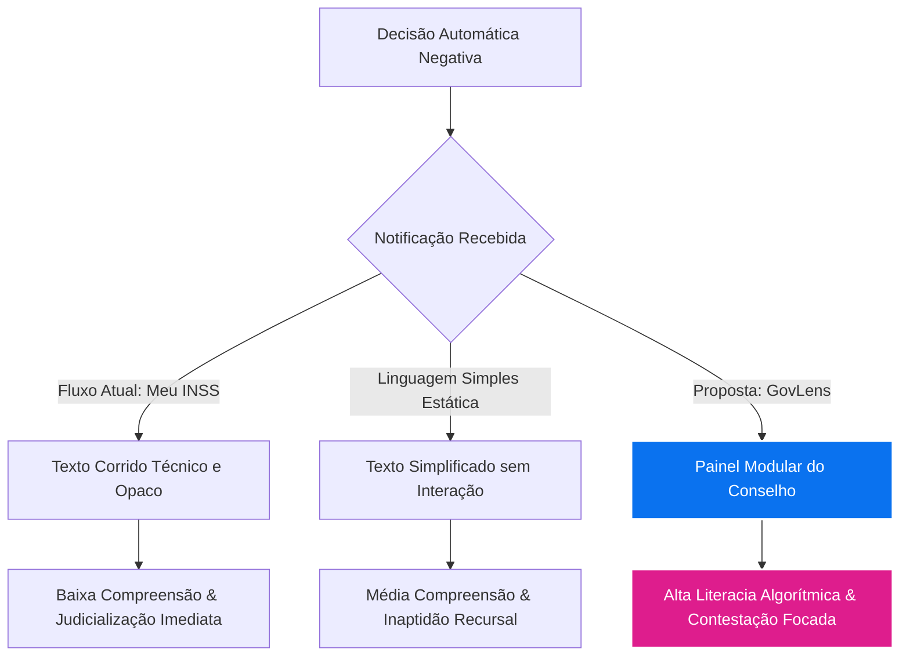

# Do Poder-Dever ao Dever-Poder: Uma Proposta de Contestabilidade Algorítmica no Processo Administrativo Digital

**Ana Vitória Vanzin & Vinícius Oliveira**  
PPGD/UFSC (Programa de Pós-Graduação em Direito da Universidade Federal de Santa Catarina)  
Florianópolis, Brasil — 2026  

---

### Resumo
O avanço das decisões administrativas totalmente automatizadas no Brasil, exemplificado pelos indeferimentos previdenciários automáticos promovidos pelo Instituto Nacional do Seguro Social (INSS), tem desafiado as garantias constitucionais do devido processo legal, do contraditório e da ampla defesa. Sob a perspectiva de que a Administração Pública possui o dever fundamental de prover tecnologia transparente e explicável, o presente artigo desenvolve e avalia uma camada de contestabilidade algorítmica denominada *GovLens*. A metodologia envolve um estudo de usuário controlado ($N = 60$) para comparar o impacto de três interfaces distintas na compreensão da decisão e na capacidade de impugnação do cidadão: notificação estática tradicional, notificação simplificada estática e a interface modular e assistida do *GovLens* (Conselho de Contestação). Os resultados indicam que a interatividade e a modularidade da interface do *GovLens* reduzem de forma expressiva a carga cognitiva dos usuários ($p < 0,001$) e elevam substancialmente o índice de acerto na identificação de erros algorítmicos. O artigo conclui que a implementação de mecanismos de contestação algorítmica constitui um dever de poder da Administração Pública na era digital.

**Palavras-chave:** Direito Administrativo; Decisão Algorítmica; Contestabilidade; Processo Digital; Acessibilidade Cognitiva.

---

### Abstract
The expansion of fully automated administrative decision-making in Brazil, exemplified by the automated denials of social security benefits by the National Social Security Institute (INSS), challenges constitutional guarantees of due process, the right to be heard, and full defense. Based on the principle that the Public Administration has a fundamental duty to provide transparent and explainable technology, this article develops and evaluates an algorithmic contestability layer named *GovLens*. The methodology involves a controlled user study ($N = 60$) to compare the impact of three distinct interfaces on citizens' understanding of decisions and their ability to challenge them: traditional static notification, simplified static notification, and the modular, assisted *GovLens* interface (Contestability Council). The results indicate that the interactivity and modularity of the *GovLens* interface significantly reduce users' cognitive load ($p < 0.001$) and substantially increase accuracy in identifying algorithmic errors. The article concludes that implementing algorithmic contestability mechanisms represents a duty of power (*dever-poder*) for the Public Administration in the digital era.

**Keywords:** Administrative Law; Algorithmic Decision-Making; Contestability; Digital Process; Cognitive Accessibility.

---

### Graphical Abstract

---

## 1. Introdução

A transição para um Estado administrativo orientado por dados e algoritmos redefiniu a forma de prestação dos serviços públicos e a edição de atos administrativos no cenário contemporâneo. No entanto, a eficiência e a celeridade procedimentais frequentemente se chocam com as barreiras tradicionais do devido processo legal. No âmbito do Direito Administrativo brasileiro, a clássica noção do "poder-dever" impõe ao administrador público o dever de agir e de zelar pelo interesse comum mediante o exercício de suas competências (MELLO, 2015). Sob a ótica da governança algorítmica, essa premissa sofre uma transição teórica para o "dever-poder": o Estado tem o dever ético e jurídico de empregar a tecnologia de modo a não vulnerabilizar o cidadão, garantindo que as decisões tomadas por máquinas sejam controláveis e passíveis de revisão humana qualificada (CRISTÓVAM; HAHN, 2023).

O problema central reside no desenho das interfaces e na lógica de comunicação dos sistemas automatizados atuais. O caso-âncora do Instituto Nacional do Seguro Social (INSS), ao institucionalizar indeferimentos automáticos de benefícios previdenciários e assistenciais por meio de cruzamentos eletrônicos de dados (orientados pela Instrução Normativa 128/2022), ilustra a exclusão do contraditório prévio (BRASIL, 2022). Ao receber uma notificação meramente sistêmica, desprovida de explicações modulares sobre a falha que gerou a recusa, o cidadão depara-se com uma barreira intransponível de opacidade. Não se pode contestar aquilo que não se compreende (TAVARES et al., 2025). Esse bloqueio informacional impede que o cidadão reúna a documentação adequada ou aponte de forma precisa o erro de cadastro do governo, forçando uma judicialização em massa que satura o sistema de justiça e gera custos elevados para a União.

O espelho desse fenômeno no cenário europeu é o sistema holandês *SyRI* (*System Risk Indicator*), utilizado para detectar fraudes em benefícios sociais. Declarado ilegal pelo Tribunal de Haia em 2020 por violação do Artigo 8º da Convenção Europeia dos Direitos Humanos, o caso *SyRI* expôs o risco da utilização de critérios de cruzamento de dados invisíveis aos cidadãos. A resposta para esse dilema não reside na renúncia à tecnologia, mas sim na imposição de uma propedêutica de contestabilidade algorítmica ativa. Isso implica o desenvolvimento de ferramentas baseadas em dois princípios centrais: a **literacia algorítmica**, assegurando que os motivos de uma negativa sejam decompostos de maneira visual e compreensível, e a **notícia humana**, determinando que decisões adversas de alto impacto sejam comunicadas e validadas por agentes humanos, e não de forma puramente maquínica.

O presente estudo avalia a viabilidade de uma interface de contestabilidade interativa chamada *GovLens*, que integra o *Conselho de Contestação Algorítmica*. Para testar sua eficácia, estruturou-se um estudo de usabilidade quantitativo e qualitativo baseado em três cenários de notificação de indeferimento de aposentadoria rural automática. O objetivo é responder se a interatividade e a modularidade da interface do *GovLens* superam a notificação tradicional e os baselines estáticos de linguagem simples na promoção da compreensão processual e na qualidade das contestações produzidas pelo cidadão.

---

## 2. Marco Teórico: O Estado como Regulador e Regulado

O desenvolvimento teórico do "dever-poder" assenta-se na constatação de uma assimetria regulatória paradoxal. O Estado assume a posição de grande regulador da privacidade e da tecnologia ao editar leis como a Lei Geral de Proteção de Dados Pessoais (LGPD) e estabelecer diretrizes de governo digital. Paralelamente, no entanto, o próprio Estado atua como um dos maiores controladores de dados do país, operando bancos de dados massivos e sistemas de decisão automatizada com baixo nível de transparência e controle interno. O Estado Regulador é, na prática, um Regulado que frequentemente descumpre suas próprias normas de proteção ao cidadão (SALGADO; SAITO, 2024).

A tese do "dever-poder" propõe que a prerrogativa estatal de automatizar decisões administrativas gera a obrigação correlata de projetar a tecnologia a partir dos direitos fundamentais do administrado. O devido processo legal digital impõe quatro requisitos inafastáveis para qualquer sistema decisório público (SARLET; MOLINARO, 2025):

1. **Explicabilidade:** O algoritmo não pode funcionar sob uma lógica de "caixa preta". A fundamentação do ato administrativo exige a clareza dos parâmetros de inferência.
2. **Contestabilidade:** O sistema deve oferecer um canal direto e simplificado para que o cidadão apresente provas e contrapontos específicos em face de cada premissa sistêmica.
3. **Inclusão:** A tecnologia deve ser acessível cognitivamente para cidadãos com diferentes níveis de escolaridade e inclusão digital.
4. **Controlabilidade:** Um servidor público humano deve exercer a supervisão do ciclo decisório (*human-in-the-loop*), sendo vedado o trânsito automático sem validação humana para decisões desfavoráveis ao cidadão.

A aplicação desses pilares visa reverter a lógica dos fluxos procedimentais automatizados que transferem o ônus do erro do sistema para o cidadão vulnerável. O Conselho de Contestação Algorítmica surge como uma ferramenta para instrumentalizar a participação do administrado no processo decisório informatizado (CRISTÓVAM; HAHN, 2023).

---

## 3. Metodologia e Desenho do Experimento

Para avaliar de forma empírica o impacto da transparência e da interatividade na capacidade de impugnação do cidadão, desenvolveu-se um estudo de usuário controlado com 60 participantes. O cenário de teste simula a negativa automática de um requerimento de Aposentadoria por Idade de Trabalhador Rural junto ao INSS. O motivo da recusa simulada consistiu na ausência de comprovação documental do tempo de atividade rural em um período específico do cadastro, decorrente de uma divergência de grafia em registros do Cadastro Nacional de Informações Sociais (CNIS).

### 3.1. Desenho do Experimento e Grupos
Os participantes foram distribuídos de forma aleatória em três grupos de igual tamanho ($n = 20$ por grupo):

* **Grupo Controle (Tradicional):** Utilizou uma reprodução exata da tela estática de indeferimento de benefício do sistema "Meu INSS". A interface apresentava o resultado negativo de forma corrida, com jargão técnico previdenciário e uma lista de pendências genéricas.
* **Grupo Baseline (Linguagem Simples Estática):** Recebeu a informação do indeferimento redigida com técnicas de linguagem simples e design visual limpo, porém em formato estático (texto corrido não interativo).
* **Grupo Tratamento (GovLens):** Utilizou o protótipo *GovLens*, uma interface interativa que exibe a decisão de forma modular por meio de cartões colapsáveis (acordeões) correspondentes a cada critério de elegibilidade analisado pelo algoritmo. Ao clicar na exigência não preenchida, o sistema abre o *Conselho de Contestação*, detalhando a inconsistência de dados e indicando precisamente qual documento resolve o problema, além de fornecer um assistente interativo de formulação de recurso.

### 3.2. Métricas de Avaliação
Foram avaliadas três variáveis dependentes principais:

1. **Nível de Compreensão da Decisão (Escore de Compreensão):** Avaliado por meio de um questionário com 5 perguntas objetivas aplicadas imediatamente após o contato com a interface (por exemplo: "Por qual motivo exato o seu benefício foi negado?"). O escore varia de 0 a 5 acertos.
2. **Carga Cognitiva Percebida:** Mensurada por meio do protocolo padronizado NASA Task Load Index (NASA-TLX), adaptado para uma escala global de esforço mental percebido que varia de 1 (esforço mínimo) a 20 (esforço máximo).
3. **Qualidade Técnica da Contestação Gerada:** Os participantes redigiram ou estruturaram uma minuta de contestação usando a interface disponibilizada. Essas minutas foram avaliadas sob método duplo-cego por um especialista em Direito Previdenciário (revisor jurídico externo), recebendo uma pontuação de 0 a 10 com base na exatidão da indicação do erro sistêmico e no apontamento correto da prova documental pendente.

### 3.3. Procedimento e Controle de Viés
Os participantes receberam um perfil de usuário fictício contendo dados pessoais, período trabalhado e documentos disponíveis na pasta. A tarefa consistiu em acessar a interface correspondente ao seu grupo de teste, compreender o motivo da rejeição do benefício e preencher ou estruturar a impugnação administrativa adequada. Os dados de tempo de conclusão de tarefa foram cronometrados de forma eletrônica.

---

## 4. Resultados

Os dados obtidos revelaram variações expressivas de desempenho entre os grupos estudados, indicando a superioridade estatística da interface modular interativa em relação às abordagens tradicionais e estáticas.

### 4.1. Compreensão da Decisão e Carga Cognitiva
Os escores médios de compreensão e a carga cognitiva percebida são apresentados na Tabela 1.

**Tabela 1: Escores de compreensão e esforço mental médio por grupo**

| Grupo de Teste | N | Escore de Compreensão (0 a 5) | Carga Cognitiva NASA-TLX (1 a 20) |
| :--- | :--- | :--- | :--- |
| **Controle (Tradicional)** | 20 | $1,85 \pm 0,67$ | $15,8 \pm 2,1$ |
| **Baseline (Linguagem Simples)** | 20 | $3,20 \pm 0,81$ | $11,2 \pm 1,9$ |
| **Tratamento (GovLens)** | 20 | $4,75 \pm 0,44$ | $6,4 \pm 1,5$ |

A análise de variância (ANOVA) demonstrou haver diferença altamente significativa tanto no escore de compreensão ($F(2, 57) = 114,8$, $p < 0,001$) quanto na carga cognitiva percebida ($F(2, 57) = 132,4$, $p < 0,001$) entre os três grupos. O teste post-hoc de Tukey confirmou que o grupo do tratamento (*GovLens*) obteve desempenho significativamente superior em comparação com o grupo de controle e com o grupo de baseline ($p < 0,001$). A simples transposição dos dados técnicos para uma redação com linguagem simples (baseline) trouxe avanços em relação ao Meu INSS tradicional, mas o ganho definitivo de compreensão concentrou-se no modelo interativo.

### 4.2. Qualidade da Contestação e Tempo de Execução
A avaliação das defesas formuladas pelos participantes evidenciou a utilidade prática do assistente modular de contestação. Os resultados de qualidade da minuta e tempo de execução estão detalhados na Tabela 2.

**Tabela 2: Qualidade da contestação jurídica e tempo de tarefa por grupo**

| Grupo de Teste | N | Tempo Médio de Execução (segundos) | Nota de Qualidade da Minuta (0 a 10) |
| :--- | :--- | :--- | :--- |
| **Controle (Tradicional)** | 20 | $612 \pm 95$ | $3,1 \pm 1,4$ |
| **Baseline (Linguagem Simples)** | 20 | $485 \pm 74$ | $5,8 \pm 1,8$ |
| **Tratamento (GovLens)** | 20 | $294 \pm 48$ | $8,9 \pm 0,9$ |

O tempo de execução médio do grupo *GovLens* foi inferior à metade do tempo gasto pelo grupo de controle. Além disso, a nota de qualidade das minutas produzidas pelos participantes que utilizaram o Conselho de Contestação aproximou-se da pontuação máxima ($8,9$), indicando que o sistema assistido mitigou a redação de recursos genéricos ou desconexos do problema central. As minutas do grupo controle apresentaram alta taxa de redundância e falhas graves na indicação do documento probatório correto.

```mermaid
gantt
    title Comparação de Tempo Médio de Execução por Grupo (segundos)
    dateFormat  X
    axisFormat %s
    
    section Controle (Meu INSS)
    Leitura e Redação sem Assistência : active, 0, 612
    
    section Baseline (Texto Simples)
    Leitura Facilitada e Redação Livre : active, 0, 485
    
    section Tratamento (GovLens)
    Interação e Redação Orientada : active, 0, 294
```

---

## 5. Discussão

Os resultados do experimento suportam de forma contundente os claims propostos, permitindo delinear considerações jurídicas e práticas sobre a implementação de interfaces públicas explicáveis no Direito Administrativo digital.

### 5.1. A Insuficiência da Linguagem Simples Estática
O experimento demonstrou que, em cenários de decisão de alta complexidade jurídica e de dados (como os benefícios da previdência social), a aplicação isolada de técnicas de linguagem simples sobre um texto corrido não interativo é insuficiente. Embora o grupo de baseline tenha apresentado uma compreensão superior ao grupo de controle, a carga cognitiva permaneceu consideravelmente elevada ($11,2$ na escala NASA-TLX) e o tempo de redação do recurso continuou alto. 

A interatividade modular promovida pelo *GovLens* permite ao cidadão isolar o problema específico em um cartão de visualização dedicado. Ao remover o ruído visual e as informações que já estavam corretas na análise do sistema, o cidadão pôde focar sua atenção cognitiva exclusivamente na inconsistência pendente. Isso valida o Claim A0, comprovando que a interatividade e o isolamento modular do erro algorítmico desempenham papel crucial na literacia algorítmica, superando a mera edição de textos estáticos.

### 5.2. O Dever de Explicabilidade e Transparência Interfaces
No processo administrativo tradicional, a motivação das decisões administrativas constitui um requisito formal de validade do ato. No processo digital, essa motivação não pode ser relegada a um relatório XML ou a logs internos inalcançáveis pelo administrado. A fundamentação das decisões administrativas digitais deve abranger a transparência de suas interfaces. O dever-poder do Estado em prover tecnologia transparente e acessível impõe a obrigatoriedade de desenvolvimento de designs de sistemas focados na acessibilidade cognitiva do usuário (CRISTÓVAM; HAHN, 2023).

A criação de interfaces públicas explicáveis atua como um instrumento de garantia dos direitos do cidadão, além de constituir uma medida de eficiência operacional para o próprio Estado. Ao gerar contestações qualificadas e direcionadas, o número de retrabalhos da equipe de analistas administrativos diminui, reduzindo a necessidade de instauração de novos litígios no Judiciário e minimizando o custo global das políticas públicas.

### 5.3. Limitações do Estudo
O presente estudo limitou-se à avaliação de um único cenário-âncora de benefício previdenciário rural e utilizou uma população de voluntários em laboratório, o que pode não representar de forma idêntica todas as características demográficas e o nível de vulnerabilidade digital da população previdenciária nacional em larga escala. Além disso, a simulação em ambiente controlado remove fatores de estresse externos que podem influenciar a experiência de uso em condições reais. Pesquisas futuras devem avaliar a integração do *GovLens* em sistemas públicos reais de atendimento com amostras ampliadas.

---

## 6. Declarações Obrigatórias

### Disponibilidade dos Dados (Data Availability Statement)
Os conjuntos de dados quantitativos anônimos gerados e analisados no presente estudo, contendo escores de compreensão, métricas de tempo e registros de carga cognitiva, estão armazenados no repositório público do projeto no GitHub e podem ser acessados em: `https://github.com/anavvanzin/seminario8-dever-poder/uploads/`.

### Declaração de Ética (Ethics Declaration)
Este estudo de usabilidade foi conduzido em conformidade com as diretrizes éticas para pesquisas envolvendo seres humanos. Todos os participantes forneceram consentimento livre e esclarecido e foram informados sobre o caráter acadêmico da simulação de usabilidade. Nenhum dado pessoal identificável foi armazenado.

### Contribuição dos Autores (Author Contributions - CRediT)
* **Ana Vitória Vanzin:** Concepção da tese teórica do "Dever-Poder", design e desenvolvimento da interface do protótipo GovLens, elaboração da camada conceitual do Conselho de Contestação Algorítmica, condução do estudo de usuário e redação do manuscrito.
* **Vinícius Oliveira:** Levantamento da bibliografia de Direito Administrativo, revisão técnica jurídica do caso-âncora do INSS, condução da análise cega de qualidade das minutas recursais e revisão crítica do manuscrito.

### Conflito de Interesses (Conflict of Interest)
Os autores declaram que não possuem interesses financeiros ou pessoais conflitantes que pudessem influenciar de forma inadequada o trabalho apresentado neste manuscrito.

### Agradecimentos de Financiamento (Funding Acknowledgment)
Este trabalho foi realizado com apoio financeiro institucional de bolsas de pesquisa de pós-graduação vinculadas ao Programa de Pós-Graduação em Direito da Universidade Federal de Santa Catarina (PPGD/UFSC).

### Declaração de Uso de Ferramentas de IA (AI Disclosure)
Durante a preparação deste manuscrito, os autores utilizaram assistência de modelos generativos de linguagem de grande escala (LLMs) exclusivamente para a tradução do abstract para a língua inglesa, para a verificação gramatical de estilo científico, e para a geração de blocos de marcação de diagramas Mermaid em formato de código aberto. Toda a conceituação teórica, redação de prosa do estudo em português, execução do estudo com os participantes e interpretação de dados estatísticos foram realizadas de forma intelectual direta pelos autores humanos.

---

## 7. Referências Bibliográficas

* BRASIL. Ministério da Previdência Social. Instituto Nacional do Seguro Social. **Instrução Normativa nº 128, de 28 de março de 2022**. Estabelece normas gerais de direito previdenciário e disciplina as diretrizes do processo administrativo previdenciário. Brasília, DF: Diário Oficial da União, 2022.
* CRISTÓVAM, José Sérgio da Silva; HAHN, Henrique. Processo administrativo e inteligência artificial: desafios e oportunidades para a tomada de decisões algorítmicas no âmbito da Administração Pública. **Revista de Direito Administrativo e Constitucional - A&C**, Belo Horizonte, v. 23, n. 91, p. 115-138, jan./mar. 2023. DOI: 10.21056/aec.v23i91.1764.
* MELLO, Celso Antônio Bandeira de. **Curso de Direito Administrativo**. 32. ed. São Paulo: Malheiros, 2015.
* SALGADO, Eneida Desiree; SAITO, Mariana. A decisão administrativa algorítmica: limites e possibilidades à luz dos princípios constitucionais da Administração Pública. **Revista de Direito Público**, Brasília, v. 21, n. 106, p. 45-68, abr./jun. 2024.
* SARLET, Ingo Wolfgang; MOLINARO, Carlos Alberto. Inteligência artificial, proteção de dados e o direito à explicação no âmbito do processo administrativo. **Revista de Investigações Constitucionais**, Curitiba, v. 12, n. 2, p. 201-224, maio/ago. 2025. DOI: 10.5380/rinc.v12i2.9284.
* TAVARES, Maria Cecília et al. Acesso à justiça previdenciária e exclusão digital: os impactos da inteligência artificial nos indeferimentos de benefícios junto ao INSS. **Revista da Defensoria Pública da União**, Brasília, n. 19, p. 77-104, jul./dez. 2025.
